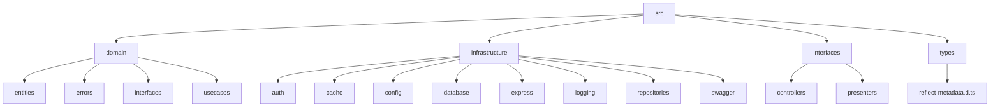
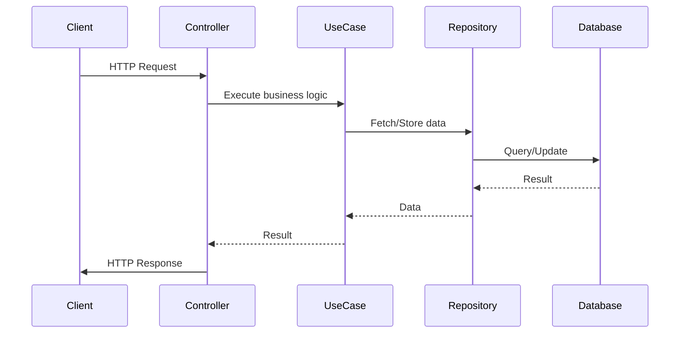
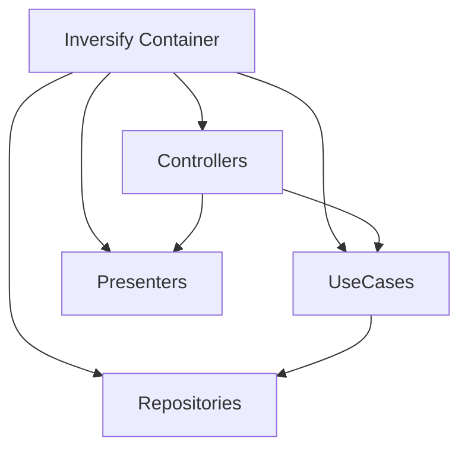
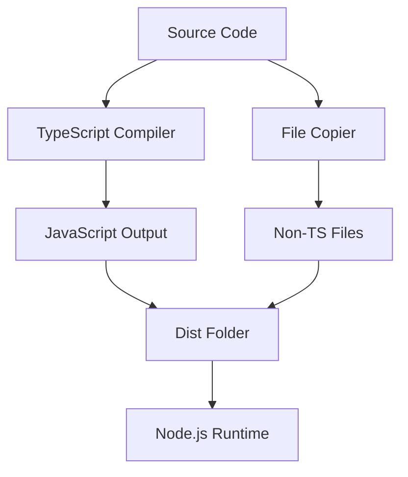

# Project Structure and Implementation Details

## Overview

This project implements a Clean Architecture-based Express.js application with TypeScript. It provides authentication functionality including user registration, login, token refresh, and logout. The application uses MongoDB for data persistence and Redis for caching.

## Project Structure

## Architecture

The project follows Clean Architecture principles, separating concerns into different layers:

1. **Domain Layer** (`src/domain`): Contains business logic, entities, and use cases.
2. **Infrastructure Layer** (`src/infrastructure`): Handles external concerns like databases, caching, and framework setup.
3. **Interface Layer** (`src/interfaces`): Manages the presentation of data and user interactions.

## Key Components

### Domain Layer

1. **Entities**: Define the core business objects (e.g., User).
2. **Use Cases**: Implement application-specific business rules.
3. **Interfaces**: Define contracts for repositories and other dependencies.

### Infrastructure Layer

1. **Auth**: Handles JWT token generation and verification.
2. **Cache**: Manages Redis connection and operations.
3. **Config**: Stores application configuration.
4. **Database**: Manages MongoDB connection.
5. **Express**: Sets up the Express application and server.
6. **Logging**: Configures application logging.
7. **Repositories**: Implements data access logic.
8. **Swagger**: Configures API documentation.

### Interface Layer

1. **Controllers**: Handle HTTP requests and responses.
2. **Presenters**: Format data for presentation to the client.

## Data Flow

## Dependency Injection

The project uses InversifyJS for dependency injection. The container is configured in `src/infrastructure/config/inversify.config.ts`.

## Error Handling

Custom errors are defined in `src/domain/errors/CustomError.ts`. The application uses a global error handler middleware to catch and format errors consistently.

## API Documentation

Swagger is used for API documentation. The configuration is in `src/infrastructure/swagger/swagger.ts`, and individual API definitions are in YAML files under `src/infrastructure/swagger/definitions/`.

## Testing

Jest is used for unit testing. Test files are located next to the files they test with a `.test.ts` extension.

## Build and Deployment

The project uses TypeScript for development and is compiled to JavaScript for production. The build process includes:

1. TypeScript compilation
2. Copying of non-TypeScript files (e.g., Swagger YAML files)

Docker is used to set up development dependencies (MongoDB and Redis).

This structure allows for a clear separation of concerns, making the codebase more maintainable and testable. The use of dependency injection further enhances the modularity of the application.
